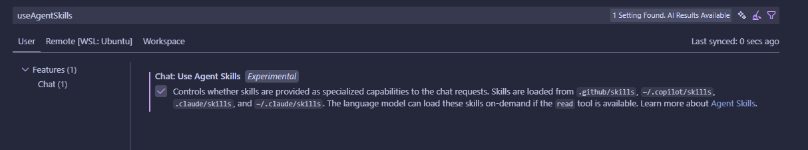

# cumulocity-skills

Machine-readable Agent Skills with modular guidance, examples, and best practices you can add to your agent.

---

## Available Skills

| Skill | Path | Summary |
|---|---:|---|
| Frontend layout & references | `skills/c8y-ui/SKILL.md` | Codex-aligned project scaffolding, layout rules, icons, forms, pipes. |

---

### Purpose & Advantages

- Enables AI agents to generate consistent, accessible code that follows Cumulocity conventions. 🤖
- Easy to extend: add new skills as features or patterns evolve. ✨
---

## Quick install

1. Enable “Use Agent Skills” in Visual Studio Code:



2. Add the skill pack to your agent (runs via `npx`):

```bash
npx skills add Cumulocity-IoT/cumulocity-skills
```

3. Example agent prompts:

- "Use `/c8y-ui` to create a responsive Angular form for Device Registration with fields: deviceName (text, required), deviceType (select), firmwareVersion (text), and supportFiles (file-picker). Provide the HTML template and brief validation rules."
- "Use `/c8y-ui` to refactor this view to follow Codex foundations (typography, grid, spacing)."

---


## References

- https://cumulocity.com/docs/web/gettingstarted/
- https://cumulocity.com/codex/
- https://agentskills.io/specification

---

## License & Disclaimer

Provided as-is. See `LICENSE` for details. 

This project is provided as-is and without warranty or support. It is not a constitute part of the Cumulocity product suite. Users are free to use, fork and modify them, subject to the license agreement. While Cumulocity welcomes contributions, we cannot guarantee to include every contribution in the master project.
