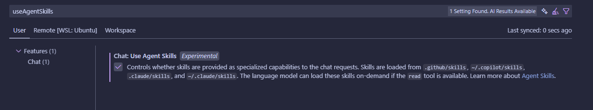

# cumulocity-skills

Machine-readable Agent Skills with modular guidance, examples, and best practices you can add to your agent.
Currently consisting of skills for Cumulocity upgrade planning, migration analysis, changelog review, and code quality analysis.

---
## Purpose

### Advantages

- Centralized guidance for Web SDK upgrades and `@c8y/client` migration impact analysis.
- Repeatable analysis flow that starts from changelogs and version-specific upgrade notes.
- Better audit quality by combining API references, version mapping, and code quality checks.
- Modular skill set that can be extended with new version guides and analysis workflows.

---

## Quick install

1. Enable “Use Agent Skills” in Visual Studio Code:



2. Add the skill pack to your agent (runs via `npx`):

```bash
npx skills add Cumulocity-IoT/cumulocity-skills
```

3. Example agent prompts:

- "Use `/c8y-client-migration-analysis` to audit this Angular project for a target Web SDK 1023 upgrade and produce a breaking-change impact matrix."
- "Use `/websdk-1023-upgrade` and `/websdk-breaking-changelog` to list required code changes and potential regressions for this app."
- "Use `/c8y-client-api` to map `InventoryService` and `MeasurementService` calls in this file to their REST endpoints."
- "Use `/code-quality-analysis` to review these changed Angular files and report anti-patterns with fixes."

---

## Available Skills

Frontend Skills:

| Skill | Path | Summary |
|---|---:|---|
| C8Y Client API Reference | `skills/c8y-client-api/SKILL.md` | `@c8y/client` services, methods, and endpoint usage patterns. |
| C8Y Client Breaking Changelog | `skills/c8y-client-breaking-changelog/SKILL.md` | Breaking changes in `@c8y/client` across versions. |
| C8Y Client Migration Analysis | `skills/c8y-client-migration-analysis/SKILL.md` | Step-by-step migration audit workflow and impact classification. |
| Code Quality Analysis | `skills/code-quality-analysis/SKILL.md` | Angular + Cumulocity quality checks and anti-pattern detection. |
| Web SDK 1018 Upgrade | `skills/websdk-1018-upgrade/SKILL.md` | Version-specific guidance for upgrading to Web SDK 1018. |
| Web SDK 1019 Upgrade | `skills/websdk-1019-upgrade/SKILL.md` | Version-specific guidance for upgrading to Web SDK 1019. |
| Web SDK 1020 Upgrade | `skills/websdk-1020-upgrade/SKILL.md` | Version-specific guidance for upgrading to Web SDK 1020. |
| Web SDK 1021 Upgrade | `skills/websdk-1021-upgrade/SKILL.md` | Version-specific guidance for upgrading to Web SDK 1021. |
| Web SDK 1022 Upgrade | `skills/websdk-1022-upgrade/SKILL.md` | Version-specific guidance for upgrading to Web SDK 1022. |
| Web SDK 1023 Upgrade | `skills/websdk-1023-upgrade/SKILL.md` | Version-specific guidance for upgrading to Web SDK 1023. |
| Web SDK Breaking Changelog | `skills/websdk-breaking-changelog/SKILL.md` | Breaking changes for Web SDK / `@c8y/ngx-components`. |
| Web SDK Version Map | `skills/websdk-version-map/SKILL.md` | Version mapping context used during upgrade planning. |

Architecture Skills:

| Skill | Path | Summary |
|---|---:|---|
| Chassis Advisor | `skills/c8y-architect-microservice-chassis-advisor/SKILL.md` | Decision matrix and recommendation workflow for microservice chassis selection. |
| Platform Migration PKI | `skills/c8y-architect-platform-migration-pki/SKILL.md` | Best practices and approaches for migrating PKI certificates to Cumulocity. |


---

## Agent Workflow

Use the analysis skills as entry points, because they reference and orchestrate the other skills:

1. Start with `c8y-client-migration-analysis` for upgrade impact and migration audits.
2. Use version-specific `websdk-10xx-upgrade` and changelog skills to confirm required changes.
3. Validate API usage with `c8y-client-api` and version compatibility with `websdk-version-map`.
4. Run `code-quality-analysis` on changed files before finalizing recommendations.

See `agents.md` for a concise structure-first guide.

---

## References

- https://cumulocity.com/docs/web/gettingstarted/
- https://www.npmjs.com/package/@c8y/client
- https://www.npmjs.com/package/@c8y/ngx-components
- https://agentskills.io/specification

---

## License & Disclaimer

Provided as-is. See `LICENSE` for details. 

This project is provided as-is and without warranty or support. It is not a constitute part of the Cumulocity product suite. Users are free to use, fork and modify them, subject to the license agreement. While Cumulocity welcomes contributions, we cannot guarantee to include every contribution in the master project.
