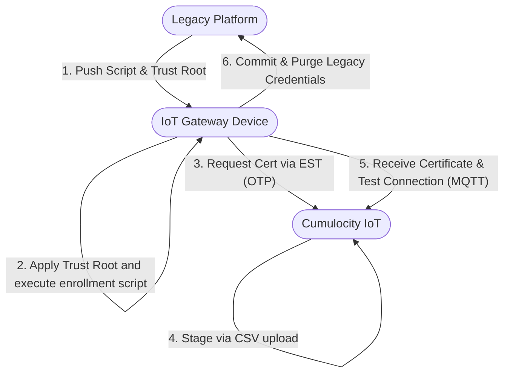

# IoT Gateway Migration Guide: Legacy Platform to Cumulocity IoT (PKI & Certificate Focus)

This document serves as a comprehensive operational blueprint for migrating a fleet of 250,000 IoT gateways to Cumulocity IoT. The migration strategy relies on Cumulocity’s native Certificate Authority (CA) features and a secure Bulk Device Registration workflow using derived One-Time Passwords (OTPs).

---

## Chapter 1: Migration Flow Overview

The migration follows a phased, throttled approach to transition devices without interrupting field operations. Because hardware capabilities (such as the presence of a Trusted Platform Module/TPM) are currently unconfirmed, the orchestration logic resides within an intelligent migration script deployed to the gateways via the legacy device management platform.

### Single-Device Migration Lifecycle

For any single gateway, the transition moves through five distinct execution gates:



### Fleet-Wide Sequential Execution

To protect cloud infrastructure and network bandwidth, the migration is executed in sequential chunks (e.g., 20,000 devices per wave).

1. **Canary Phase:** A small, diverse subset of test devices is migrated manually to validate the script across all edge variations.
2. **Batch Orchestration:** The legacy platform targets batches sequentially.
3. **Randomized Jitter:** Within each batch, gateways execute their enrollment requests using randomized time delays to flatten the API load curve.

---

## Chapter 2: Pre-Migration & Platform Preparation

Before a single device attempts to connect to Cumulocity, both the target cloud environment and the security payload must be staged.

### Cumulocity-Specific Details

* **Bulk Registration Engine:** Cumulocity processes identity staging via a CSV upload file. The platform creates shell device entries in an `ACCEPTED` state, waiting for a matching incoming request via the [Enrollment over Secure Transport (EST) protocol](https://cumulocity.com/docs/device-certificate-authentication/device-enroll-and-re-enroll/).
* **Trust Anchor Upload:** The root or intermediate CA certificate that will sign the device certificates must be uploaded and activated within the Cumulocity Tenant Settings.

### Challenges & Risks

* **Credential Exposure:** Using easily guessable device identifiers (like plain serial numbers) as the OTP allows malicious actors to scan the physical asset tags of field gateways, spoof the EST request, and hijack device ownership in Cumulocity.
* **Server Trust Mismatch:** If the gateway's operating system does not recognize the Root CA trusted by your Cumulocity tenant's load balancer (e.g., Let's Encrypt or DigiCert), the TLS handshake will immediately fail before enrollment even begins.

### Best Practices

* **Token Derivation (HMAC):** If a TPM is available, use it to secure a Master Secret. If a TPM's presence is unknown, store a Master Secret in a root-restricted configuration file. Derive the unique OTP cryptographically on both the server and the device using:

$$\text{OTP} = \text{HMAC-SHA256}(\text{Master Secret}, \text{Device Serial})$$


* **Pre-Provision Trustroots:** Use the legacy platform to push Cumulocity's public endpoint Root CA certificates directly to the gateway's local trust store (e.g., `/etc/ssl/certs/`) ahead of execution.

* **Pre-Provision the Registration Script:** Stage the enrollment script on each gateway via the legacy platform before the migration wave begins. The script must derive the OTP (see HMAC formula above), generate a private key and CSR, and call the EST `simpleenroll` endpoint. A minimal reference implementation:

```bash
DEVICE_ID="$(read-hardware-serial)"   # replace with actual HW serial reader
DEVICE_ONE_TIME_PASSWORD="$(hmac_sha256 "$MASTER_SECRET" "$DEVICE_ID")"
C8Y_DOMAIN="example-tenant.cumulocity.com"

# Generate private key
openssl ecparam -genkey -name prime256v1 -out device-private-key.pem

# Generate CSR with CN matching the Device ID (required for MQTT Client ID mapping)
openssl req \
    -new \
    -key device-private-key.pem \
    -noenc \
    -subj "/C=DE/O=My Company/OU=IoTGateway/CN=${DEVICE_ID}" \
    -out device.csr

# Enroll via EST — credentials are Device ID : OTP
curl https://${C8Y_DOMAIN}/.well-known/est/simpleenroll \
    -sfv \
    -u "${DEVICE_ID}:${DEVICE_ONE_TIME_PASSWORD}" \
    --data-binary @device.csr \
    -H "Content-Type: application/pkcs10" \
    -H "Accept: application/pkcs10" \
    -o device-certificate.pem
```

  The resulting `device-certificate.pem` and `device-private-key.pem` are used for MQTT connections on ports 8883/9883. Ensure the MQTT Client ID is set to `$DEVICE_ID` to satisfy Cumulocity's CN-matching requirement.

---

## Chapter 3: The Enrollment & Execution Phase

This phase covers the script execution on the gateway and its interaction with Cumulocity’s bootstrap endpoints.

### Cumulocity-Specific Details

* **Execution of registration:** The EST enrollment process is triggered by the gateway's local script, which must authenticate using the derived OTP and submit a properly formatted CSR to Cumulocity’s EST endpoint.
* **EST Endpoint:** Devices interact with the simple enrollment API via the path: `https://<tenant>.<domain>/.well-known/est/simpleenroll`
* **CN and Identity Mapping:** The MQTT broker inside Cumulocity strictly mandates that the **Common Name (CN)** embedded in the client certificate’s Subject exactly matches the **MQTT Client ID** used during connection.

### Challenges & Risks

* **API Denial of Service (DoS):** Triggering 20,000 devices simultaneously at a scheduled time will overload tenant rate limits, resulting in `HTTP 429 Too Many Requests` or `HTTP 502 Bad Gateway` errors.
* **Time Synchronization (NTP) Drift:** If a gateway’s local system clock drifts or resets during migration, it may generate an X.509 Certificate Signing Request (CSR) with an invalid timestamp, or reject Cumulocity's server certificate as "not yet valid."

### Best Practices

* **NTP Hard-Gate:** The migration script must check the synchronization status of the local time daemon (e.g., `timedatectl`) and halt execution if the clock is unsynced.
* **Client-Side Execution Jitter:** Introduce a randomized sleep interval inside the bootstrap script:
```bash
# Sleep randomly between 1 second and 2 hours (7200 seconds)
sleep $((RANDOM % 7200))

```


* **Programmatic CSR Construction:** Ensure the script automatically reads the unique hardware identifier (MAC, IMEI, or Serial) and injects it dynamically as the `CN` value into the OpenSSL CSR generation flag (`-subj "/CN=$DEVICE_ID"`).

---

## Chapter 4: Connectivity, Monitoring & Rollback Watchdogs

Once a certificate is acquired, the gateway must prove it can reliably maintain communications with the new platform before cutting ties with the old one.

### Cumulocity-Specific Details

* **Audit Trail Tracking:** Failed certificate validation attempts, mismatched CN parameters, and unauthorized device connection drops are automatically logged by the platform under the `TenantCertificateAuthority` audit log category.
* **Inventory Custom Fragments:** Successfully authenticated devices can update their Managed Object inventory with custom string fragments to reflect their migration status.

### Challenges & Risks

* **The "Orphaned Device" Scenario:** If a gateway successfully requests a certificate but fails to connect via MQTT due to a firewall or routing misconfiguration, and it has already discarded its legacy configuration, it becomes permanently disconnected and requires physical maintenance.

### Best Practices

* **Atomic Rollback Watchdog:** Implement a dual-keystore script mechanism. The script keeps the legacy connection active while attempting to establish a secondary connection to Cumulocity.
* **The 30-Minute Stability Rule:** The watchdog must monitor the Cumulocity MQTT connection for a continuous 30-minute window. If the connection drops or fails to publish basic telemetry within this window, the script must wipe the new certificate and revert back to the legacy platform parameters.
* **Real-time Migration Dashboard:** Build a dashboard in Cumulocity using standard Cockpit widgets. Have successfully migrated devices send a payload indicating success:
```json
{
  "c8y_MigrationStatus": {
    "status": "COMPLETED",
    "timestamp": "2026-05-22T12:00:00Z"
  }
}

```


Complement this by querying Cumulocity System Audit logs to display a real-time error counter showing devices failing the EST authentication phase.

---

## Chapter 5: Day 2 Operations & Cleanup

The migration process is incomplete until the temporary entry paths are closed and long-term maintenance routines are established.

### Cumulocity-Specific Details

* **Device Re-enrollment API:** Cumulocity allows a connected device that already possesses a valid, unexpired client certificate to request a new certificate automatically without providing an OTP again.

### Challenges & Risks

* **Stale OTP Vectors:** OTP credentials uploaded via the bulk registration CSV remain active in the cloud database indefinitely for any devices that failed to undergo migration (e.g., hardware powered down or broken in the field). This leaves an active back-door identity mapping on the tenant.

### Best Practices

* **Post-Wave CSV Purging:** At the end of each daily 20,000-device wave, run an automated script via the Cumulocity REST API to query pending bulk registrations, identify devices still in an `ACCEPTED` state, and delete those placeholder entries to invalidate their OTP tokens.
* **Automated Certificate Renewal (Day 2):** Embed a lifecycle loop within your gateway's production daemon. When the client certificate reaches **80% of its total validity duration**, the gateway must use its current certificate to authenticate against Cumulocity’s re-enrollment API endpoint to seamlessly pull down a renewed certificate before expiration.